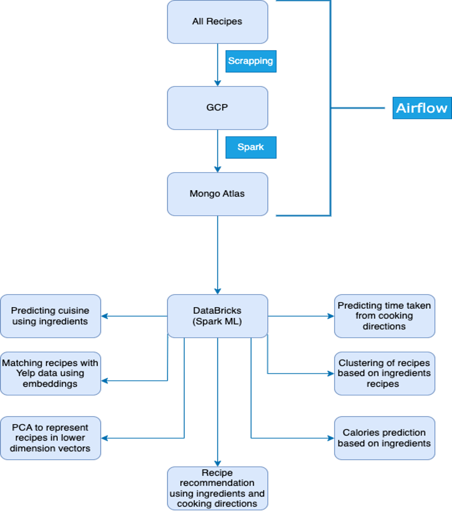

## Project Overview
Idea to build a recipe recommender system. The system will take a recipe as input and recommend similar recipes. We also created multiple useful predictive models like predicting time to cook, rating, calories along the way. The system is built on top of Google Cloud Platform (GCP), MongoDB and Spark on Databricks. 

### Step-1

Data creation: We scrapped the data from allrecipes.com and yelp and pushed to GCS. Automated the runs through Airflow. Relevant scripts are 'data_collection_pipeline_dag.py' and 'scrape_all_recipes.py'.

### Step-2

Data preprocessing: We cleaned some part of the data while data creation step itself and some part in Spark in this step and then created aggregates and pushed to recipe database in MongoDB. Relevant scripts are 'aggregates_to_mongo.py' and 'data_collection_pipeline_dag.py'.

### Step-3

Connected Mongo to spark on databrick and used Spark ML to build the following models:
1. **Predict recipe/cuisine type of recipe**. Created a simple model using Bag of Words and Logistic Regression. Relevant notebook is 'recipe_type_classification.ipynb'.
2. **Create recipe recommeder system**. Using ingredients and cooking directions as features created embeddings for recipes through LaBSE sentence transformer model. Used cosine similarity to find similar recipes. Relevant notebook is 'recommending_similar_recipes.ipynb'.
3. Create **clustering model** to group similar recipes. Used miniLM sbert model to create embeddings and created clusters using KMeans. Relevant notebook is 'Recipe_clustering_PCA_calorie_prediction.ipynb'.
4. **Predict calories of recipe**. Used miniLM sbert model to create embeddings and created randomForest model to predict calories.Relevant notebook is 'Recipe_clustering_PCA_calorie_prediction.ipynb'.
5. **PCA to find lower dimension representation** of recipes. Used miniLM sbert model to create embeddings and created PCA model to find lower dimension representation of recipes. Relevant notebook is 'Recipe_clustering_PCA_calorie_prediction.ipynb'.
6. **Predict cooking time** of recipe. Used miniLM sbert model to create embeddings, preprocessed through dense representation and created randomForest model to predict cooking time using the cooking directions. Relevant notebook is 'cooking_time_prediction.ipynb'.
7. **Datasources matching**. Used sentence transformer model to create embeddings and used cosine similarity to match recipes from different sources. Relevant notebook is 'recipe_matching_across_diff_datasources.ipynb'.